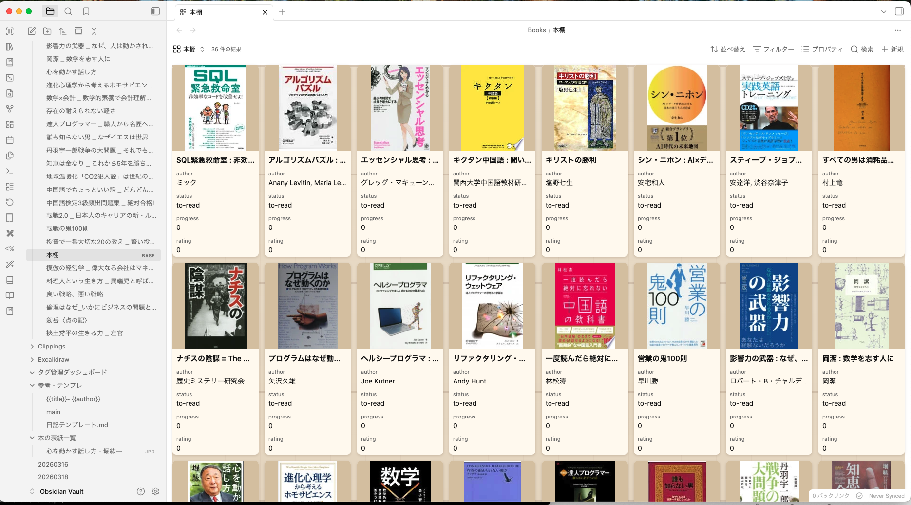

# ISBN Bulk Import Bookshelf Builder

An Obsidian plugin that fetches book metadata from ISBN and helps you manage your personal bookshelf as notes.

## Features

- **Fetch book metadata by ISBN** from NDL (National Diet Library of Japan), Google Books, and Open Library
- **Automatic cover image download** with WebP conversion and local caching
- **Bookshelf views via Bases** (Want to read / Reading / Finished)
- **Manual entry and editing** of book notes
- **Manual cover image** (drag & drop, clipboard paste, or file picker)
- **Bulk ISBN extraction** from back-cover images to CSV
- **OCR fallback** for printed ISBN-10 and ISBN-13 text when a barcode cannot be read (macOS)
- **Bulk bookshelf creation** from an ISBN CSV file
- **High-resolution cover refresh** with low-resolution rejection and provider fallback

## From back-cover photos to an Obsidian bookshelf

1. Take photos of the back covers of your books with an iPhone or camera.
2. Select the photo directory from the barcode-scan icon in the Obsidian sidebar.
3. The plugin detects ISBN barcodes, with OCR fallback for printed ISBN text, and exports a CSV file.
4. Select that CSV from the library icon to fetch metadata and build the bookshelf.



## Installation

### From the Obsidian Community Plugins (planned)

Search for `ISBN Bulk Import Bookshelf Builder` in **Settings → Community plugins** and install.

### Manual installation

Download the latest `main.js`, `manifest.json`, and `styles.css` from the [Releases](../../releases) page and place them in:

```
<Vault>/.obsidian/plugins/isbn-bulk-import-bookshelf-builder/
├── main.js
├── manifest.json
└── styles.css
```

Then enable **ISBN Bulk Import Bookshelf Builder** in **Settings → Community plugins**.

### Via BRAT

Add this repository through the [BRAT](https://github.com/TfTHacker/obsidian42-brat) plugin.

## Usage

1. Click the **barcode-scan** ribbon icon to scan ISBN
   barcodes from a directory of JPG, PNG, WebP, GIF, BMP, HEIC, or HEIF images.
2. Click the **library** ribbon icon to fetch metadata and create book
   notes in bulk. The importer accepts an `isbn` column, or ISBNs in the first
   column of a headerless CSV.
3. Use the **book-marked** ribbon icon to edit an existing book note.
4. Replace a cover via **"Set cover image manually"** in the command palette.
5. Run **"Refresh metadata and descriptions for all books"** to update existing
   notes in bulk while preserving reading status, progress, ratings, and notes.

## Requirements

- Desktop only (uses Electron file dialog and local filesystem for cover caching).
- Primarily intended for books published in Japan, especially ISBNs beginning with
  `978-4`. Overseas books may work when metadata is available from Google Books or
  Open Library, but they are not currently guaranteed or fully tested.

## Network use

This plugin makes HTTPS requests to the following public services to fetch book metadata and cover images by ISBN. No personal data is sent — only the ISBN you enter.

- **NDL (National Diet Library of Japan)** — `https://ndlsearch.ndl.go.jp` — primary metadata source for Japanese books.
- **Google Books API** — `https://www.googleapis.com/books/v1` — fallback metadata source.
- **Open Library** — `https://openlibrary.org` and `https://covers.openlibrary.org` — final fallback for metadata and cover images.

All requests are issued through Obsidian's `requestUrl` API and are only triggered by an explicit user action (entering an ISBN). No background or telemetry traffic is generated.

## File system access

On desktop, the **"Set cover image manually"** command opens an Electron file picker so you can choose an image from anywhere on your local disk. The selected file is read once via Node `fs`, converted to WebP, and saved into your vault's configured covers folder. The plugin does not retain any path outside your vault.

## Vault access

The plugin enumerates Markdown files in the vault (`vault.getMarkdownFiles()`) for two reasons:

1. **Duplicate detection** — when you add a book by ISBN, the plugin scans existing notes for the same `isbn` value in frontmatter to avoid creating duplicates.
2. **Book picker** — the "Select and edit book note" command lists existing book notes filtered by the `kind: book` frontmatter.

The plugin does not read note bodies; only frontmatter is inspected. No file content is sent over the network.

## Development

### Prerequisites

- Node.js 24 (LTS) or later
- pnpm 9 or later

### Setup

```sh
pnpm install
```

### Commands

| Command | Description |
| --- | --- |
| `pnpm dev` | Build in watch mode |
| `pnpm build` | Type check + production build (emits `main.js`) |
| `pnpm typecheck` | TypeScript type check only |
| `pnpm lint` | Run Biome lint |
| `pnpm format` | Run Biome format (`--write`) |
| `pnpm check` | Run Biome lint + format (`--write`) |
| `pnpm check:ci` | Run Biome checks without writing |

### Releasing

Push a Git tag (matching the `manifest.json` version, **no `v` prefix**) and the GitHub Actions release workflow will build and attach `main.js`, `manifest.json`, and `styles.css` to the release.

```sh
# After bumping manifest.json and package.json
git tag 0.0.3
git push origin 0.0.3
```

## Plugin identity

This fork uses the plugin ID `isbn-bulk-import-bookshelf-builder`, so it can be
installed alongside the original `easy-obookshelf` plugin.

## License

[MIT](./LICENSE)

---

## 日本語

ISBN から書籍メタデータを取得してノートを作成し、本棚として管理する Obsidian プラグインです。

### 主な機能

- ISBN からの自動メタデータ取得（NDL / Google Books / Open Library）
- 表紙画像のダウンロード・WebP 変換・キャッシュ
- Bases ファイルによる本棚ビュー（読みたい / 読書中 / 読了）
- 書籍ノートの手動入力・編集
- 表紙画像の手動設定（ドラッグ&ドロップ / クリップボード貼り付け対応）
- 裏表紙画像から ISBN を一括検出して CSV 出力
- ISBN 一覧 CSV から書籍ノートを一括作成
- 低解像度画像を除外し、高解像度の表紙を優先して保存
- 既存書籍の書誌情報・概要を一括再取得

### 裏表紙の写真から Obsidian の本棚へ

1. iPhoneやカメラで、本の裏表紙をまとめて撮影します。
2. Obsidianサイドバーのバーコードスキャンアイコンから、写真が入ったフォルダを選択します。
3. バーコードを検出し、読み取れない場合は印刷されたISBN文字列をOCRで補完して、ISBN一覧CSVを作成します。
4. ライブラリアイコンから作成したCSVを選択すると、書誌情報と表紙を取得して本棚を一括作成します。


### 一括登録

1. サイドバーのバーコードスキャンアイコンから、
   JPG / PNG / WebP / GIF / BMP / HEIC / HEIF 画像が入ったフォルダを選択します。
2. `filename,isbn,status,error` 形式の CSV が作成されます。読み取れなかった画像も
   `not_found` として残るため、必要に応じて ISBN を手入力できます。
   バーコードを検出できない場合は、印刷されたISBN文字列をmacOSのVision OCRで
   読み取ります。画像は外部へ送信されません。
3. サイドバーのライブラリアイコンから CSV を選択します。`isbn` 列の有効な
   ISBNを重複除去し、既存の重複ISBN設定に従って書籍ノートを作成します。

### コマンドパレット

- 「表紙画像を手動で設定」: 開いている書籍ノートの表紙を差し替えます。
- 「全書籍の書籍情報・概要を再取得」: ISBN付きノートを一括更新します。読書状態、
  進捗、評価、日付、メモ、既存表紙は維持されます。
- 「Kindle Highlightsノートへ概要を一括追加」: `02_読書メモ`内のKindleノートを
  タイトル・著者でGoogle Booksと照合し、表紙と既存の見出しの間に概要を追加します。
  Kindleのハイライト、読書目的、アクションプランは維持されます。

### 対象書籍

主な対象は、日本国内で発売された書籍（特に `978-4` で始まるISBN）です。
海外書籍もGoogle BooksやOpen Libraryに書誌情報があれば登録できる場合がありますが、
現時点では十分な動作検証を行っておらず、動作保証の対象外です。

### 手動インストール

[Releases](../../releases) から `main.js` / `manifest.json` / `styles.css` をダウンロードし、`<Vault>/.obsidian/plugins/isbn-bulk-import-bookshelf-builder/` に配置してください。

### v1.0.x からの移行

このフォークのプラグイン ID は `isbn-bulk-import-bookshelf-builder` です。
元の `easy-obookshelf` と同時にインストールできます。
